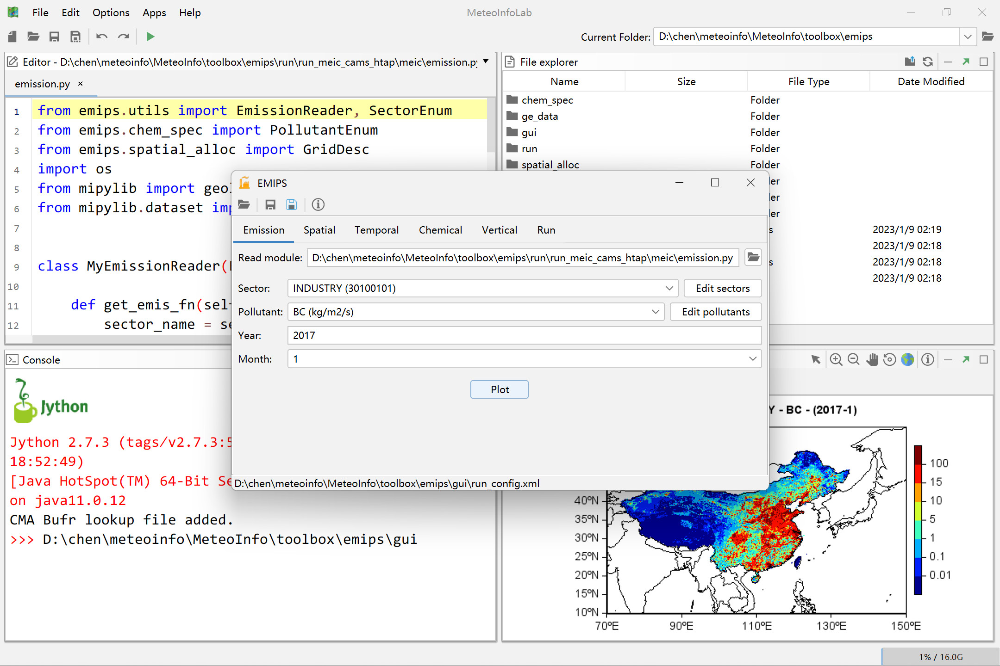

EMIPS：EMission Inventory Processing System
============================================

Installation
------------

MeteoInfo need to be pre-installed. The MeteoInfo and EMIPS can be downloaded from 
http://www.meteothink.org/downloads/index.html. Unzip and copy "emips" folder into "MeteoInfo -> toolbox" folder.

Features
--------

EMIPS (EMission Inventory Processing System) software was developed to create emission inventory (EI) data
that atmospheric chemistry models (ACMs) can be used directly. The main functions including ``Chemical speciation``,
``Temporal allocation``, ``Spatial allocation`` and ``vertical allocation``. 

Running
-------

EMIPS jython script can be running in MeteoInfoLab environment. ``run`` folder of this project
includes an example of processing emission inventory for WRF-Chem and CUACE and the cross-reference
files and profiles can be found in ``ge_data`` folder. 
For the convenience of users, we have designed a GUI for EMIPS.

Documentation
-------------

Learn more about MeteoInfo and EMIPS in its official documentation at http://meteothink.org/

Version
-------

EMIPS-1.1 was released (2023-06-24).   Added support for CMAQ and bug fixes.

EMIPS-1.0 was released (2023-01-26).

Author
------

Yaqiang Wang

email: yaqiang.wang@gmail.com

Chinese Academy of Meteorological Sciences, CMA

Wencong Chen

email: wencong9801@outlook.com

Chinese Academy of Meteorological Sciences, CMA

Publication
-----------

- Chen, W.C., Wang, Y.Q., Li, J.W., YI, Z.W., Zhao, Z.C., G, B., Che, H.Z., Zhang, X.Y., 2023. 
Description and evaluation of a newly developed emission inventory processing system (EMIPS). 
Sci. Total Environ. 870, 161909. https://doi.org/10.1016/j.scitotenv.2023.161909

License
-------

Copyright 2019-2023, EMIPS Developers

Licensed under the LGPL License, Version 3.0 (the "License");
you may not use this file except in compliance with the License.
You may obtain a copy of the License at

  http://www.gnu.org/licenses/lgpl.html

Unless required by applicable law or agreed to in writing, software
distributed under the License is distributed on an "AS IS" BASIS,
WITHOUT WARRANTIES OR CONDITIONS OF ANY KIND, either express or implied.
See the License for the specific language governing permissions and
limitations under the License.